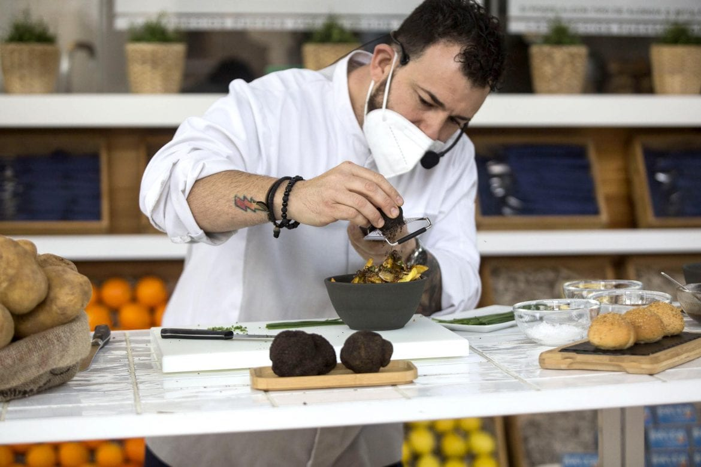

# TiendaGourtmetAndChic


Tienda online de **trufas frescas y elaborados artesanos** de Aragón, pensada para chefs,
restaurantes, tiendas gourmet y amantes de la alta gastronomía.



## Características

- Catálogo con filtros por categoría (trufa fresca, alta cocina, despensa, refrigerado…).
- Ficha de producto con formatos, cajas de 6/12 unidades y descuentos profesionales.
- Pedido por contacto: el carrito finaliza en **"Contactar para hacer pedido"**, que abre un
  formulario corto (correo, celular y ciudad) junto con el resumen del pedido.
- Responsive, sin scroll horizontal en móvil y con logo en cabecera y pie.


## Desarrollo

```bash
pnpm install
pnpm dev      # servidor de desarrollo (puerto 8443)
pnpm build    # build de producción en dist/
```

## Despliegue

El proyecto incluye `vercel.json` con un rewrite SPA a `index.html`, de modo que recargar
`/producto/...` en Vercel no devuelve 404.

---

© 2026 Gourmet & Chic · Zaragoza, España
